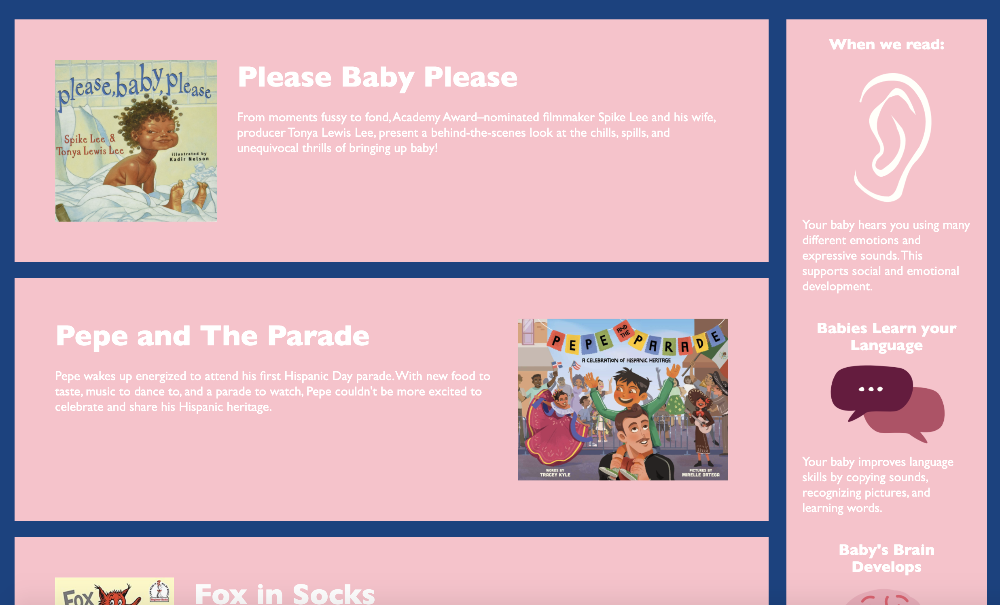

# Fahlia's Books

### _A front-end website featuring HTML and CSS to list my daughter's favorite books and the science behind why reading ._

## Table of Contents

- [Description](#Description)

- [Media](#Media)

- [Deployed Site](#deployed-site)

- [Contributors](#Contributors)

- [Contact](#Contact)

- [Project Status](#project-status)

- [License](#License)

## Media

## Deployed Site

   This is the link to view my portfolio: (https://celestealexmoore.github.io/Celeste-Moore-Portfolio/)

## Contributors

This website was created by Celeste Moore.

## Contact

If you have any questions about this repository, contact celestealexmoore via GitHub or reach out via email:
celestealexmoore@gmail.com.

## Project Status

In Progress

---

## License

© 2021 _celestealexmoore_